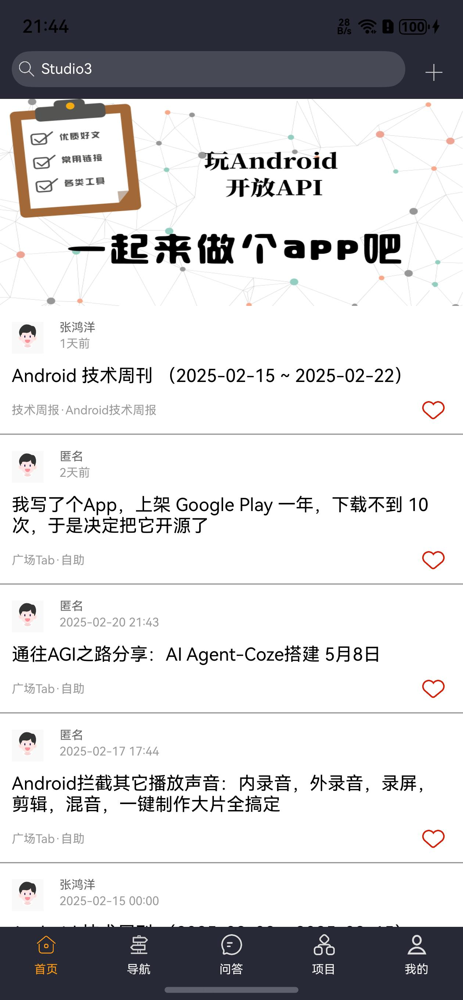
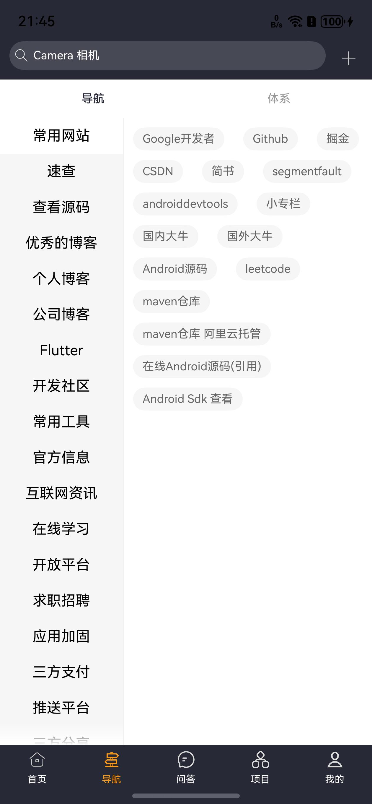
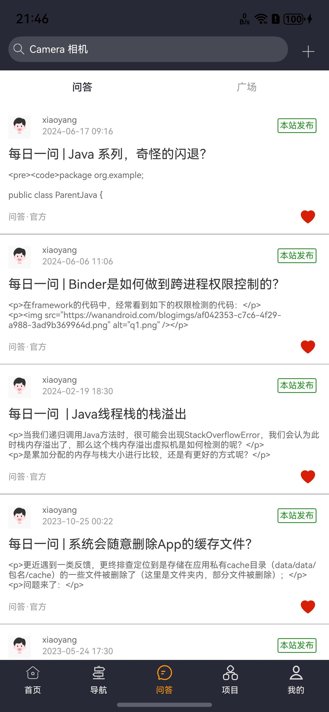
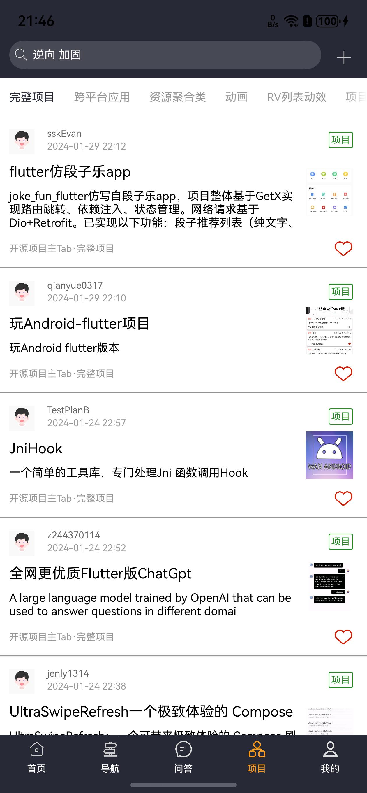
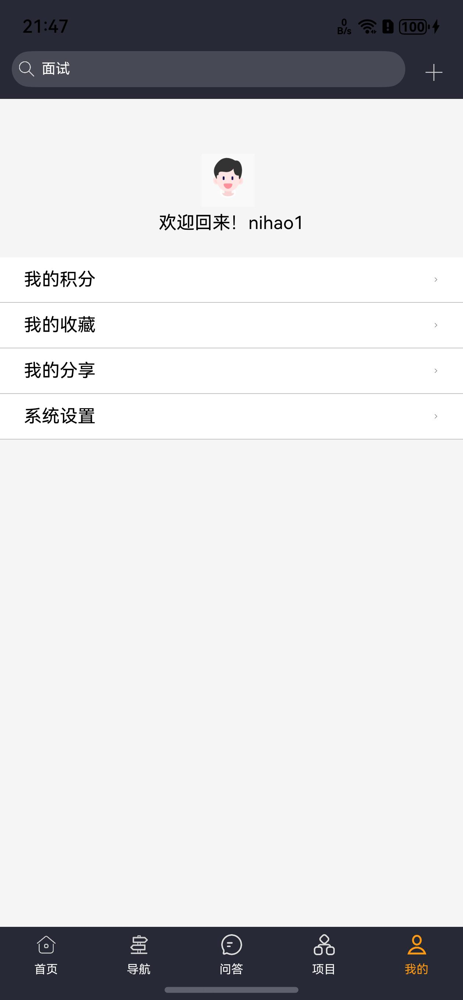
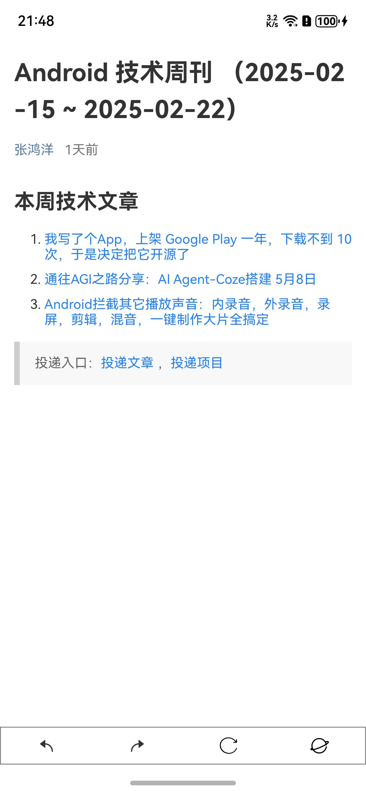

# WanAndroid_Harmony

## 基本功能

**基本实现 WanAndroid开发 Api功能**
**主题切换**

### 截图展示

----

1、图片增加图片描述、图片推理
2、视频增加视频描述、视频推理
3、通过引用的方式对话
4、增加图像生成的功能
5、引用内容的时候，软键盘遮挡
6、Text长按无法选中，原因是自定义长按和系统的 copy 冲突
通用：删除
文字：复制、搜一搜、引用（多轮对话）、翻译、重发
语音：语音理解、转文字、语音推理、语音整理
图片：图片理解、图片推理、文字提取
视频：视频理解、视频推理
7、
语音接入、菜单（大模型种类细化）、图片编辑、上划加载更多、数据库保存聊天数据、List显示最新数据，实时滑动到最底部

## 剩余问题

1、Swiper 的 DataSource无法进行懒加载。。。（目前解决方案：不使用懒加载）

2、web组件无法加载公众号网页

3、Response err: Code is 1007900994, message is {"code":1007900994,"data":"Sessions number reached limit"}

4、loginBean 无法映射？ 怪了。。。

5、聊天页面，软件盘弹出，Component 还未显示，会崩溃

# 欢迎Fork